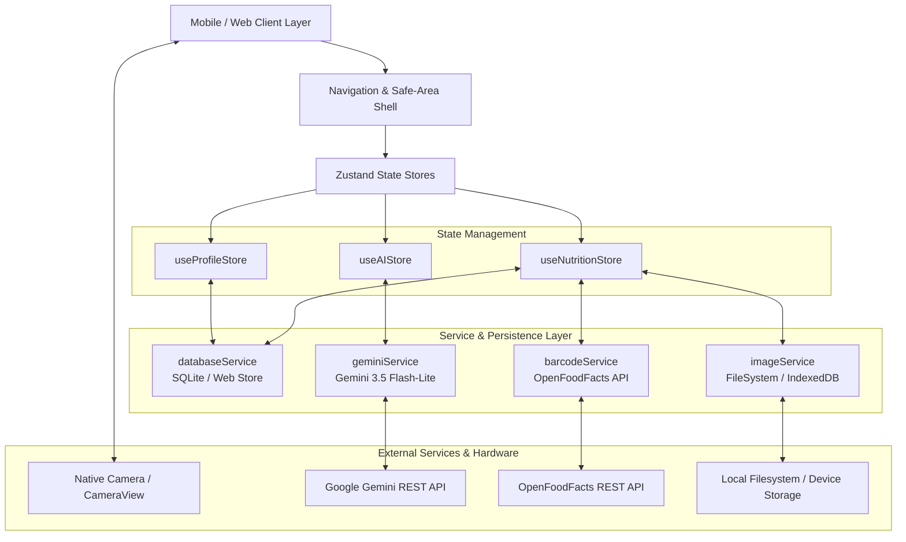

# CalorieSnap Pro — Architecture & Technical Design

Comprehensive technical architecture documentation for **CalorieSnap Pro**, an offline-first nutrition, hydration, and workout tracking mobile application built on Expo SDK 57, React Native 0.86, SQLite, and Google Gemini 3.5.

---

## 1. System Overview & Architecture Topology



---

## 2. Core Architectural Principles

1. **Offline-First & Local Sovereignty**:
   - All user data (daily meal logs, workouts, hydration records, profile metrics, and custom goals) is stored locally on-device.
   - On Native (Android / iOS), data is managed through an ACID-compliant SQLite relational database (`expo-sqlite`).
   - On Web, data persists across sessions using structured `localStorage` with `IndexedDB` for high-resolution image binaries.

2. **Sub-Second AI Vision & Multimodal Inference**:
   - Primary AI model: **`gemini-3.5-flash-lite`** (sub-second latency ~900ms–1100ms).
   - Fallback AI model: **`gemini-flash-lite-latest`** for automatic failover on 404 or transient quota spikes.
   - Strict JSON structured output mode enforced via `responseMimeType: 'application/json'` and `generationConfig.responseSchema`.

3. **Persistent Media & Cache Purge Protection**:
   - Camera and gallery pickers return transient operating-system cache URIs that mobile OSes purge periodically.
   - `imageService` copies temporary image files into permanent application storage (`FileSystem.documentDirectory + 'meals/'`) or browser IndexedDB before storing references in SQLite.

4. **Guaranteed State Consistency & Race Condition Mitigation**:
   - Double-tap locks (`isSaving` state with `try / catch / finally` guarantees).
   - Monotonic request counters (`barcodeReqIdRef`) to drop stale, out-of-order network lookups.
   - Strict boundary validations ($1 \le \text{calories} \le 10,000$, $0 \le \text{macros} \le 1,000$, $1 \le \text{duration} \le 720\text{ mins}$).

---

## 3. Storage & Database Schema Architecture

### SQLite Tables (`caloriesnap.db`)

```sql
-- 1. Meals Table (Food intake, macros, and photo references)
CREATE TABLE IF NOT EXISTS meals (
  id INTEGER PRIMARY KEY AUTOINCREMENT,
  date TEXT NOT NULL,                  -- Format: YYYY-MM-DD
  timestamp TEXT NOT NULL,             -- ISO 8601 string
  meal_type TEXT NOT NULL,             -- breakfast | lunch | dinner | snack
  name TEXT NOT NULL,
  calories REAL NOT NULL,
  protein REAL NOT NULL DEFAULT 0,
  carbs REAL NOT NULL DEFAULT 0,
  fat REAL NOT NULL DEFAULT 0,
  fiber REAL NOT NULL DEFAULT 0,
  sugar REAL NOT NULL DEFAULT 0,
  sodium REAL NOT NULL DEFAULT 0,
  portion TEXT DEFAULT '1 serving',
  image_uri TEXT                       -- Permanent local document path or IndexedDB key
);

-- 2. Exercises Table (Physical workouts and active burn)
CREATE TABLE IF NOT EXISTS exercises (
  id INTEGER PRIMARY KEY AUTOINCREMENT,
  date TEXT NOT NULL,
  timestamp TEXT NOT NULL,
  exercise_name TEXT NOT NULL,
  duration_minutes REAL NOT NULL,
  calories_burned REAL NOT NULL,
  intensity TEXT DEFAULT 'moderate',   -- low | moderate | high
  category TEXT DEFAULT 'cardio'       -- cardio | strength | flexibility | sports
);

-- 3. Water Intake Table (Hydration logs)
CREATE TABLE IF NOT EXISTS water_intake (
  id INTEGER PRIMARY KEY AUTOINCREMENT,
  date TEXT NOT NULL,
  timestamp TEXT NOT NULL,
  amount_ml REAL NOT NULL
);

-- 4. Nutritional & Activity Goals Singleton (id = 1)
CREATE TABLE IF NOT EXISTS goals (
  id INTEGER PRIMARY KEY DEFAULT 1,
  calories REAL NOT NULL DEFAULT 2000,
  protein REAL NOT NULL DEFAULT 140,
  carbs REAL NOT NULL DEFAULT 220,
  fat REAL NOT NULL DEFAULT 65,
  water_ml REAL NOT NULL DEFAULT 2500,
  exercise_minutes REAL NOT NULL DEFAULT 30
);

-- 5. User Profile Singleton (id = 1)
CREATE TABLE IF NOT EXISTS profile (
  id INTEGER PRIMARY KEY DEFAULT 1,
  name TEXT DEFAULT 'Explorer',
  gender TEXT DEFAULT 'male',
  age INTEGER DEFAULT 26,
  weight_kg REAL DEFAULT 75,
  height_cm REAL DEFAULT 178,
  activity_level TEXT DEFAULT 'moderate',
  goal_type TEXT DEFAULT 'lose_weight',
  custom_api_key TEXT DEFAULT ''       -- Encrypted/local override for Gemini API
);

-- Indices for instant date-partitioned range queries
CREATE INDEX IF NOT EXISTS idx_meals_date ON meals(date);
CREATE INDEX IF NOT EXISTS idx_exercises_date ON exercises(date);
CREATE INDEX IF NOT EXISTS idx_water_date ON water_intake(date);
```

### Web Storage Fallback Engine
When executed in a web browser (`Platform.OS === 'web'`), the database abstraction dynamically switches to a `localStorage` JSON store (`CALORIESNAP_WEB_STORE_V2`) for relational tables and `IndexedDB` (`CalorieSnapImagesDB`) for raw photo blobs, completely avoiding the 5MB browser `localStorage` quota limit.

---

## 4. State Management (Zustand Stores)

| Store | Key Responsibilities | Primary Actions |
|---|---|---|
| [`useNutritionStore`](file:///g:/Important%20Projects/calorie%20meter/src/stores/useNutritionStore.js) | Selected date, daily totals, logged meals, exercises, water intake | `setSelectedDate()`, `refreshData()`, `addMeal()`, `editMeal()`, `removeMeal()`, `logWater()`, `undoWater()`, `addExercise()` |
| [`useProfileStore`](file:///g:/Important%20Projects/calorie%20meter/src/stores/useProfileStore.js) | Physical metrics, Mifflin-St Jeor BMR/TDEE calculation, custom targets | `loadProfile()`, `saveProfile()`, `saveGoals()`, `calculateMetabolism()` |
| [`useAIStore`](file:///g:/Important%20Projects/calorie%20meter/src/stores/useAIStore.js) | Nutritionist chat, streaming responses, meal plans, daily reviews | `sendUserMessage()`, `requestDailyReview()`, `requestMealPlan()`, `clearChat()` |

---

## 5. AI Vision & Chat Engine (`geminiService.js`)

### Multimodal Pipeline
```
[User Camera / Input] 
       │
       ▼
[Image Compression: JPEG 0.45, max 1024px] ──► [cleanBase64 Stripper]
       │
       ▼
[Context Injection: Local Time, Meal Period, User Notes, Goals]
       │
       ▼
[RateLimiter: 60 RPM Custom / 15 RPM Shared]
       │
       ▼
[Gemini 3.5 Flash-Lite Request with responseSchema]
       ├── (200 OK) ──► [JSON Parse] ──► [UI Review Card]
       └── (404/400) ──► [Auto-Fallback: gemini-flash-lite-latest] ──► [UI]
```

### Token Budget & History Sanitization
- Approximates token consumption using **~4 characters per token**.
- `sanitizeChatHistory` enforces a strict **7,500 token ceiling**, preserving complete `[user -> model]` pairs and pruning leading orphaned assistant turns.

---

## 6. Mathematical Formulas & Business Logic

### Mifflin-St Jeor BMR Formula
$$\text{BMR}_{\text{male}} = 10 \times \text{weight (kg)} + 6.25 \times \text{height (cm)} - 5 \times \text{age (yrs)} + 5$$
$$\text{BMR}_{\text{female}} = 10 \times \text{weight (kg)} + 6.25 \times \text{height (cm)} - 5 \times \text{age (yrs)} - 161$$

### Total Daily Energy Expenditure (TDEE)
$$\text{TDEE} = \text{BMR} \times \text{Activity Multiplier}$$
- Sedentary: $1.20$
- Lightly Active: $1.375$
- Moderately Active: $1.55$
- Very Active: $1.725$
- Extremely Active: $1.90$

### Exercise Calorie Burn (MET Formula)
$$\text{Calories Burned} = \left(\frac{\text{MET} \times 3.5 \times \text{Weight (kg)}}{200}\right) \times \text{Duration (mins)}$$

---

## 7. Error Handling & Recovery Hierarchy

1. **Root Error Boundary (`ErrorBoundary.js`)**:
   - Catches render-phase and lifecycle exceptions across all components.
   - Renders an informative recovery view with a "Reload Screen" action instead of white-screening.

2. **Network Resilience & Offline Status (`OfflineBanner.js`)**:
   - Continuously monitors online/offline status.
   - Displays a non-intrusive status banner indicating SQLite local persistence.

3. **API Rate Limiting & Error Parser (`parseAndFormatGeminiError`)**:
   - Handles HTTP 429 (quota exhaustion), HTTP 400 (`INVALID_ARGUMENT` / schema violations), and HTTP 503 (server busy) with actionable, user-friendly instructions.
